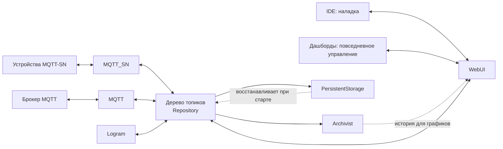
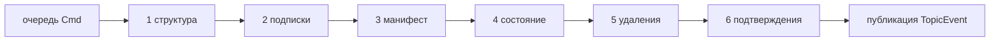
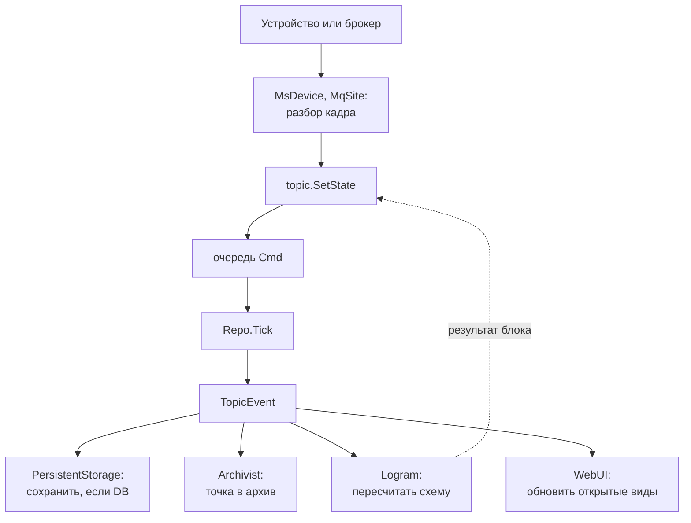
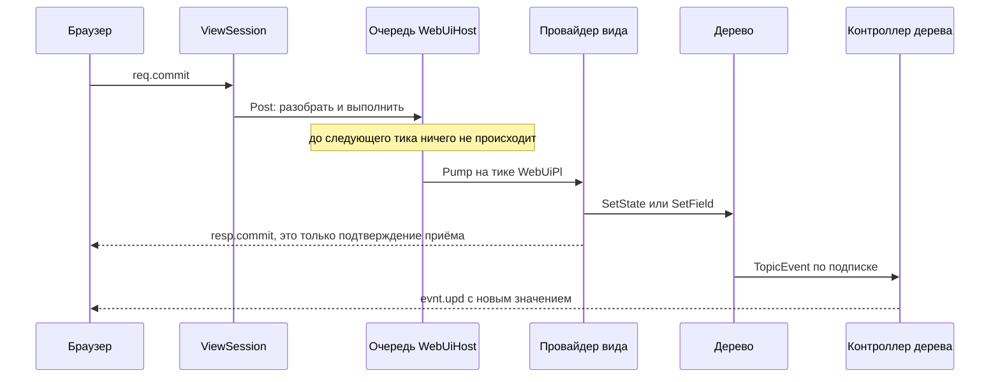
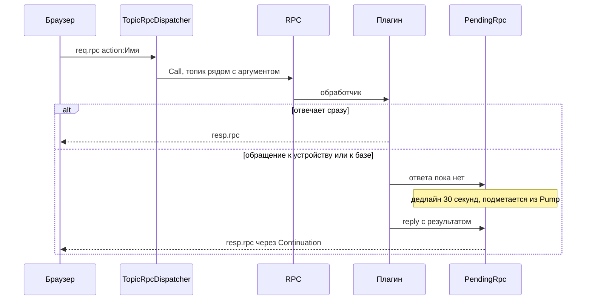
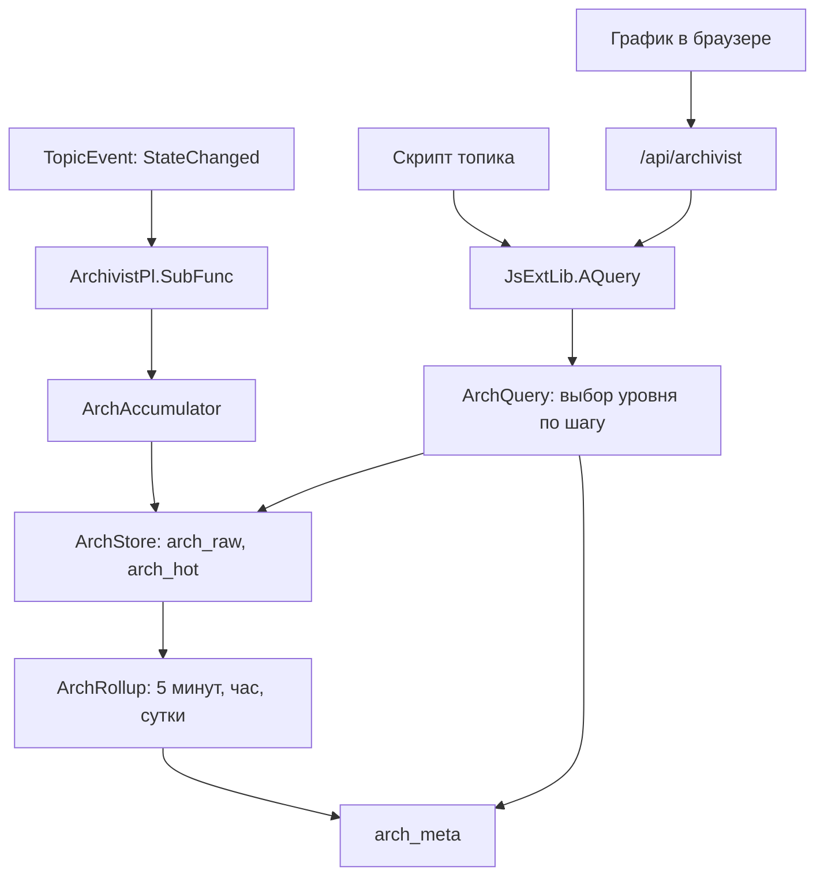

# Enviriot — low-code платформа
Берёт начало от системы автоматизации жилья. Гибкое ядро и система плагинов позволяют использовать и в других областях.
.NET Framework 4.8, один процесс, один экземпляр на машину. Работает как консольное приложение и как служба.

Краеугольным камнем системы является топик - узел дерева с состоянием и метаданными. От значения одного сенсора, до описания целого вычислительного блока. **Любой топик можно посмотреть или изменить в реальном времени.**

**Прикладная логика задаётся лограмами** — схемами визуального языка, в котором блоки соединены потоком данных. Готового блока не хватило — можно написать короткую функцию на JavaScript или собственный вычислительный блок.

## Плагины

Плагин — это сборка рядом с `enviriot.exe`, экспортирующая `IPlugModul` через MEF. 
Сервер сам по себе не умеет ничего: он находит плагины в своём каталоге, загружает их по возрастанию `priority` и
дальше только вызывает их.

| плагин | что делает |
|---|---|
| [Repository](Server/Repository/Repo.cs) | ядро: держит дерево топиков и тик — разбирает очередь изменений, применяет их и публикует события |
| [PersistentStorage](plugins/PersistentStorage/LiteDB_Pl.cs) | сохраняет состояние и манифесты в `persist.ldb` и при старте поднимает из них дерево; там же журнал сервера |
| [Archivist](plugins/Archivist/ArchivistPl.cs) | ведёт историю значений в `arch_*.ldb`: запись, свёртки по 5 минут, часу и суткам, чистка по сроку хранения и ответы на запросы графиков |
| [Logram](plugins/Logram/LogramPl.cs) | исполняет лограмы: поднимает блоки по дескрипторам из `/$YS/TYPES`, считает поток данных и пишет результат обратно в топики |
| [MQTT_SN](plugins/MQTT_SN/MQTT_SNPl.cs) | свои устройства: шлюзы на UART и UDP, обмен по MQTT-SN, шина TWI, программы PLC и компилятор Javascript -> bytecode для них |
| [MQTT](plugins/MQTT/MQTTPl.cs) | связывает топики с внешними брокерами в обе стороны; что именно публиковать и на что подписываться, топик объявляет полями `MQTT.*` |
| [WebUI](plugins/WebUI/WebUiPl.cs) | Обслуживает IDE и дашборды. HTTP и websocket: отдаёт статику, enpoints `/api/*` |

**Плагины не знают друг о друге.** Проектных ссылок между ними нет, общих типов нет, вызовов друг к
другу нет. Единственный общий адрес — путь топика, единственный способ узнать о чужой работе —
подписка на дерево. Поэтому любой сквозной путь ниже проходит через дерево, даже когда выглядит как
разговор двоих.

## Топик — единица обмена

У топика есть путь (`/A/B`), состояние (`JSValue`), манифест (метаданные, тоже `JSValue`) и
атрибуты. Всё, чем компоненты обмениваются, — это состояние и поля манифеста; своих каналов между
собой у них нет.

Три следствия, которые касаются соседей, а не самого топика:

- **`DB` в атрибутах — не «писать ли», а «хранить ли».** Хранилище на топике без этого флага не
  просто перестаёт писать, а удаляет уже сохранённую строку состояния.
- **Манифест пишется независимо от атрибутов**, и при старте хранилище восстанавливает топик под
  каждую строку манифеста. Топик без состояния существует ровно как строка манифеста — на этом
  держится всё дерево.
- **Тип — это тоже топик.** Поле `type` в манифесте указывает на топик под `/$YS/TYPES`, и то, что
  унаследовано, лежит в его *состоянии*. Разрешает наследование не ядро, а тот, кому оно нужно.

Подробности — [Topic](Server/Repository/Topic.cs).

---

## Ядро: дерево и тик

Ядро отвечает за одно: чтобы дерево в любой момент было согласованным, а все, кто на него подписан,
узнали об изменении в одном и том же порядке. Прикладного смысла оно не знает — ни что такое
устройство, ни что такое схема.

Правка ставится в очередь как команда, а не применяется на месте. Тик разбирает очередь по шести
фазам, применяет команды и только потом публикует события:

Два свойства этого устройства видны за пределами ядра, и оба существенны для плагинов:

- **Наружу выходит `TopicEvent`, а не `Cmd`.** Команда — internal, событие — public, и это разные
  типы. Событие знает только то, что уже произошло, поэтому подписчик не может отфильтровать
  намерение — только факт.
- **Структура меняется сразу, откладываются только события.** `Get(create: true)` возвращает
  готовый к работе топик на потоке вызвавшего, `Move` переставляет его там же, `Remove` немедленно
  помечает топик удалённым. Отложены применение состояния и манифеста и вся публикация. Цена
  названа прямо: подписчик, обходящий дерево, может встретить топик раньше, чем ему сказали
  `Created`.

**Подписка живёт на том топике, где её сделали**, и в поддерево не копируется — доставка
поднимается по цепочке родителей. Поэтому перемещение поддерева ничего не теряет, а подписка стоит
одинаково и на лист, и на всё дерево.

Подробности — [Repo](Server/Repository/Repo.cs), [Cmd](Server/Repository/Cmd.cs),
[TopicEvent](Server/Repository/TopicEvent.cs), [SubRec](Server/Repository/SubRec.cs).

## Плагины: контракт и порядок

`IPlugModul` — это `Init`, `Start`, `Tick`, `Stop`, свойство `enabled` и топик `Owner` под `/$YS`,
из которого плагин читает свои настройки. Больше ядро о плагине не знает ничего.

Поднимаются они по возрастанию `priority`, и порядок здесь несущий, а не декоративный:

| priority | плагин | почему здесь |
|---|---|---|
| 1 | Repository | дерева до него не существует, а `enabled` каждый читает из дерева |
| 2 | PersistentStorage | наполняет дерево сохранённым до того, как его начнут читать |
| 3 | Archivist | подписывается, когда топики уже есть |
| 5 | Logram | подписки мало: дерево наполнено раньше, поэтому он ещё и обходит его в `Start` |
| 7 | MQTT_SN | поднимает шлюзы и находит устройства |
| 8 | MQTT | подключается к брокерам |
| 10 | WebUI | последний: открывает порт, когда всё остальное готово отвечать |

Главный поток тикает по таймеру и вызывает `Tick()` в том же порядке; период — около 16-17 мс, и
реальные значения публикуются в `/$YS/Performance`, чтобы их можно было смотреть, а не угадывать.

**`Init` и `Start` вправе кинуть исключение.** Сервер пишет отказ, обрывает старт и останавливает
всё, до чего дошёл, включая тот самый плагин, — значит `Stop` получает наполовину построенный
объект и не должен ничего предполагать о том, что `Init` успел. Контракт записан в
[IPlugModul](Server/IPlugModul.cs).

**Плагин привязывается к топику подпиской на своё поле.** Реестра в ядре нет: `MQTT` ждёт
`MQTT.uri`, `MQTT_SN` — `MQTT-SN.model`, `Logram` — `Logram.block` и `Logram.bind`. Имя поля
принадлежит плагину, ядро не знает ни одного из них, и добавить восьмой плагин можно, не тронув
ядра.

## Путь значения снаружи внутрь

`SetState` не меняет значение на месте — он ставит команду в очередь, и значение появляется в тике.
Событие получают все четверо подписчиков, и каждый решает сам: хранилище смотрит на `DB`, архив на
`Arch.enable`, Logram на то, участвует ли топик в схеме, WebUI на то, открыт ли документ, где эта
строка видна. Отправитель ни о ком из них не знает.

Обратный путь такой же: результат блока Logram или запись из браузера — это тот же `SetState`,
после которого `MsDevice` или `MqSite` увидят событие по своей подписке и отправят его наружу.

---

## Два интерфейса: IDE и дашборды

Оба живут в плагине WebUI и на одном порту, но это интерфейсы под разные задачи, и почти всё у них
разное.

| | IDE | дашборды |
|---|---|---|
| для кого | наладчик, разработчик | пользователь установки |
| что показывает | дерево целиком, инспектор, лограмы, каталог, журнал | заранее собранную страницу: график, кнопку, регулятор |
| протокол | `req.*` / `resp.*` / `evnt.*` по vid | табличные кадры `C`, `P`, `S`, `A` |
| кто собирает страницу | никто, интерфейс один на все установки | автор установки, файлами в `Output\www` |
| доступ | закрыт по сети целиком | открыт по сети, право решает каждый топик |
| фронтенд | Lit, каталог `www/ide` | symbiote, каталог `www/components` |

**Разные модели доступа — это решение, а не переходное состояние.** IDE правит дерево, то есть
устройство всей установки, и потому закрыт по сети; дашборд открывают те, кто установкой просто
пользуется, с любого устройства, и он пускает всех — но показывает только то, что топик о себе
объявил. Свести их к одной настройке значило бы либо запереть дашборд, либо открыть наружу
редактор дерева.

Общего у них ровно две вещи: порт и то, что работа сессий обоих идёт на движковом потоке через одну
очередь заданий. Подробности — [WebUiHost](plugins/WebUI/WebUiHost.cs),
[ViewSession](plugins/WebUI/ViewSession.cs), [DashboardSession](plugins/WebUI/ApiDashboard.cs).

## Путь правки из IDE

Ответ на команду и новое значение приходят **разными сообщениями**: `resp.*` говорит «принято», а
что получилось — приезжает потом, по подписке, тем же путём, каким приехало бы чужое изменение.

Вся работа сессий идёт на потоке движка: сокет только кладёт задание в очередь, разбирает её
`WebUiPl.Tick`. Поэтому в слое видов нет блокировок — одновременного доступа к состоянию сессии не
возникает, и разрушение сессии тоже происходит между заданиями, а не параллельно им. Обратная
сторона правила: всё, что может занять секунды — загрузка каталога по сети, запрос истории лога, —
обязано уйти с этого потока, иначе на нём остановится весь сервер.

## Действие и отложенный ответ

Действие — способ попросить плагин что-то сделать. Оно объявляется в манифесте топика, и вызвать
имя, которого топик не объявлял, нельзя.

Дедлайн живёт на сервере, потому что на клиенте его нет вовсе: обработчик, забывший ответить, иначе
повесил бы промис на всю жизнь страницы. Сторож «ровно один ответ» стоит в `RPC.Call`, а не в
плагинах: второй ответ ушёл бы под тем же идентификатором, и клиент получил бы результат чужого
запроса.

Путь один на четверых вызывающих: контекстное меню дерева, кнопки в панелях Inspector и кадр `A`
дашборда.

Подробности — [RPC](Server/Rpc.cs),
[TopicRpcDispatcher](plugins/WebUI/Helpers/TopicRpcDispatcher.cs),
[PendingRpc](plugins/WebUI/Helpers/PendingRpc.cs).

## История значения

Пишет архив подписка, читают — двое: HTTP-эндпоинт графиков и скрипты через `JsExtLib.AQuery`.
Между ними один и тот же `ArchQuery`, который по запрошенному шагу выбирает, откуда отвечать: из
сырых отсчётов или из готовых свёрток. Клиент и сервер при этом договорены о сетке — обе стороны
считают одни и те же границы корзин, иначе точки графика ездили бы при панорамировании.

Подробности — [ArchivistPl](plugins/Archivist/ArchivistPl.cs),
[ArchStore](plugins/Archivist/ArchStore.cs), [ArchQuery](plugins/Archivist/ArchQuery.cs),
[ArchTime](plugins/Archivist/ArchTime.cs).

---

## Контракты границ

**Плагин ↔ дерево.** Плагин привязывается к топику подпиской на *своё* поле, и имя поля принадлежит
ему; наследование от типового топика разрешает тот, кому оно нужно, а не ядро.

**Ядро ↔ плагин.** Наружу видно `TopicEvent`, а не `Cmd`; структура применяется сразу, события
откладываются. Исключение из подписчика — ошибка плагина и пишется как предупреждение; исключение
из применения — ошибка репозитория и пишется как ошибка. Плагин, кинувший исключение из `Tick()`,
продолжает получать тики: один плохой проход не должен превращаться в подсистему, которая больше
никогда не работает.

**Сервер ↔ браузер.** Строка вида адресуется `vid`, команды идут как `req.*`, изменения как
`evnt.*`, и ответ на команду означает «принято», а не «выполнено». Часть констант обязана
совпадать у клиента и сервера — размер клетки Logram, минимальный размер холста, — и это дубль
осознанный: клиент считает раскладку сам. Расхождение ловит
[ClientContractTests](Tests/ClientContractTests.cs), вычитывая константы прямо из клиентского файла.

**Сервер ↔ устройство.** Разбор кадра MQTT-SN идёт через один валидатор заголовка; кадр, который
шлюз отказался прочитать, — событие на проводе, а не отказ сервера, и логируется как
предупреждение с ограничением частоты. Идентификатор поля в эфире и локальный путь этого поля —
разные вещи, поэтому переименование поля в дереве устройства не касается.

**Сервер ↔ база.** У встроенного `base.xst` два независимых рычага, и помнить надо оба: `UserVersion`
решает, читать ли файл вообще, а `ver` элемента — применять ли именно его. Забыл первое — импорт не
запустится; забыл второе — запустится и молча ничего не изменит. Рядом с гейтом в
[LiteDB_Pl](plugins/PersistentStorage/LiteDB_Pl.cs) лежит TODO с направлением: сделать гейтом
отпечаток самого файла, чтобы рычаг остался один. Разовые изменения данных, которые из `base.xst`
не выражаются, живут в [tools/Migrate](tools/Migrate/) и помечают себя топиками-маркерами.

**Дашборд ↔ топик.** Право объявляет сам топик, полями `dashboard.netRW` и `dashboard.netRO` в
манифесте; разрешение идёт от ближайшего объявления вверх и вниз по дереву, побеждает самый длинный
совпавший путь. Нет объявления — нет доступа. Подробности —
[NetworkAcl](plugins/WebUI/Helpers/NetworkAcl.cs),
[DashboardAcl](plugins/WebUI/Helpers/DashboardAcl.cs).

## Куда смотреть за деталями

| вопрос | где ответ |
|---|---|
| Что такое топик, как устроены путь, имя и атрибуты | [Topic](Server/Repository/Topic.cs) |
| Как разбирается очередь изменений, что такое фазы | [Repo](Server/Repository/Repo.cs), [Cmd](Server/Repository/Cmd.cs) |
| Что видит подписчик и какие бывают маски | [TopicEvent](Server/Repository/TopicEvent.cs), [SubRec](Server/Repository/SubRec.cs) |
| Формат `.xst`, импорт и экспорт поддерева | [Xst](Server/Repository/Xst.cs) |
| Контракт плагина, запуск и остановка сервера | [IPlugModul](Server/IPlugModul.cs), [Program](Server/Program.cs) |
| Как читать `JSValue`, не наступив на `Null` | [JsLib](Server/JsLib.cs) |
| Скрипты, таймеры, config-топики | [JsExtLib](Server/JsExtLib.cs) |
| Журнал, подавление потока отказов | [Log](Server/Log.cs), [FaultThrottle](Server/FaultThrottle.cs) |
| Хранение состояния, бэкап, перестройка файла | [LiteDB_Pl](plugins/PersistentStorage/LiteDB_Pl.cs) |
| Формат ключа архива, чтение блоками | [ArchStore](plugins/Archivist/ArchStore.cs) |
| Выбор уровня свёрток, семантика запроса | [ArchQuery](plugins/Archivist/ArchQuery.cs), [ArchTime](plugins/Archivist/ArchTime.cs) |
| Когда чистится история и почему не чаще | [ArchRetention](plugins/Archivist/ArchRetention.cs) |
| Блок, пин, переменная, поток данных схемы | [LoBlock](plugins/Logram/LoBlock.cs), [LoVariable](plugins/Logram/LoVariable.cs) |
| Раскладка схемы и маршрутизация проводов | [LogramGraphController](plugins/WebUI/Views/Logram/LogramGraphController.cs), [LogramWireRouter](plugins/WebUI/Views/Logram/LogramWireRouter.cs) |
| Разбор кадра MQTT-SN, устройства | [MsMessages](plugins/MQTT_SN/MsMessages.cs), [MsDevice](plugins/MQTT_SN/MsDevice.cs) |
| Подключение к брокеру MQTT | [MqSite](plugins/MQTT/MqSite.cs) |
| Протокол IDE: сессия, очередь заданий | [ViewSession](plugins/WebUI/ViewSession.cs), [WebUiHost](plugins/WebUI/WebUiHost.cs) |
| Протокол дашбордов | [DashboardSession](plugins/WebUI/ApiDashboard.cs) |
| Дерево в браузере: строки, разворачивание, меню | [TopicTreeController](plugins/WebUI/Trees/TopicTreeController.cs) |
| Разовые миграции данных | [tools/Migrate](tools/Migrate/Program.cs) |
| Перенос старого архива Firebird | [tools/ArchConv](tools/ArchConv/) |
