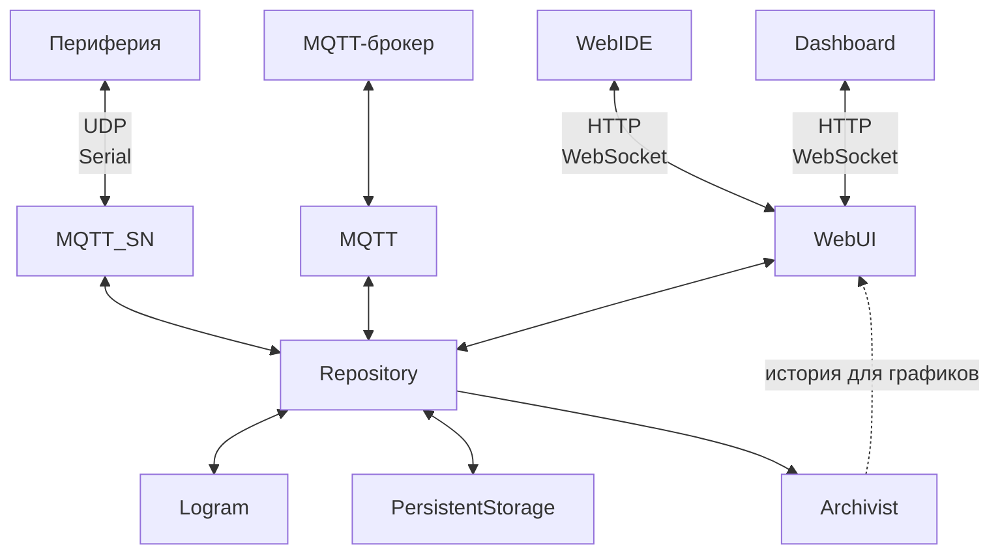
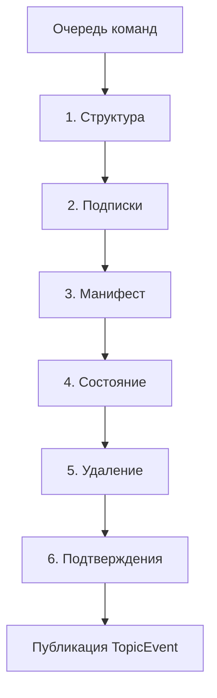
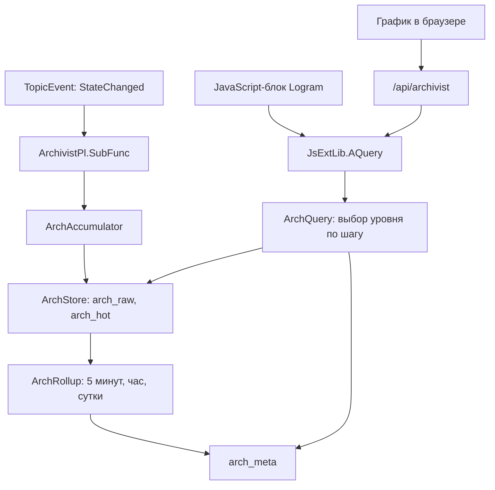
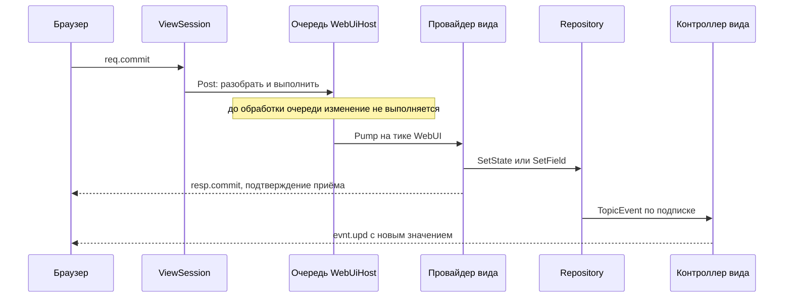
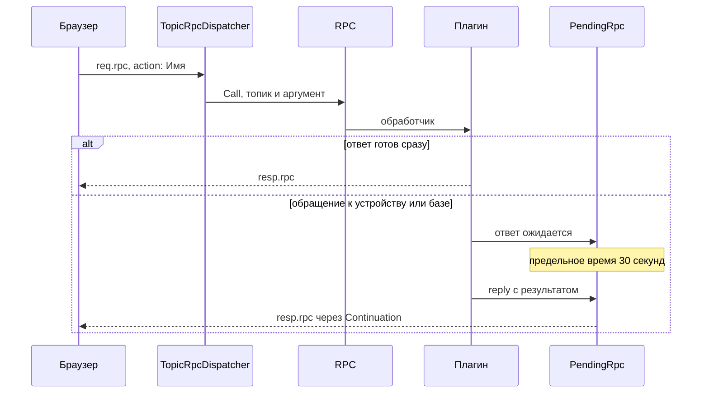

# Enviriot

**Low-code платформа для управления устройствами и автоматизации процессов.**

С её помощью можно объединять устройства в единую систему, следить за состоянием и управлять в реальном времени, выстраивая собственную логику их совместной работы.

В основе Enviriot лежат три составляющие:

- **Топики** содержат состояние, конфигурацию и описание каждого элемента системы.  
  >_Устройство, его настройка, показание датчика или результат вычисления представлены одинаково: как топики в общем дереве. Благодаря этому состояние всей системы можно наблюдать и изменять в реальном времени._
- **Лограммы** задают логику управления в виде визуальных схем.  
  >_Лограммы связывают топики в работающие алгоритмы. Визуальные блоки получают данные, обрабатывают их и передают результат дальше. Среди готовых блоков есть блок для выполнения пользовательского JavaScript, а при желании можно создать собственный вычислительный блок._
- **Плагины** добавляют новые возможности.  
  >_Плагины подключают устройства и внешние системы, обеспечивают хранение данных и накопление истории для графиков, выполняют лограммы и обслуживают пользовательские интерфейсы. Новые возможности реализуются отдельными плагинами и не требуют изменения ядра платформы._

## Как это работает

Enviriot состоит из сервера и набора плагинов. Сервер загружает компоненты, управляет их жизненным циклом и предоставляет общую среду выполнения. Плагины подключают устройства и внешние системы, сохраняют и обрабатывают данные, выполняют логику автоматизации и предоставляют пользовательские интерфейсы.

- **Repository** хранит дерево топиков и последовательно обрабатывает изменения на каждом тике. Он загружается как плагин с приоритетом 1, но собран вместе с сервером, поэтому описан в разделе «Сервер».
- **PersistentStorage** сохраняет состояние и конфигурацию топиков, а при запуске восстанавливает дерево.
- **Archivist** накапливает историю значений и подготавливает данные для построения графиков.
- **Logram** выполняет лограммы, передаёт данные между вычислительными блоками и записывает результаты в топики.
- **MQTT_SN** подключает устройства по протоколу MQTT-SN, используя UART или Ethernet/UDP в качестве транспорта.
- **MQTT** обеспечивает двусторонний обмен данными между топиками и внешними MQTT-брокерами.
- **WebUI** предоставляет два браузерных интерфейса:
  - **WebIDE** предназначен для настройки системы, разработки лограмм и диагностики;
  - **Dashboard** предназначен для повседневного наблюдения и управления. Каждый дашборд создаётся как отдельная HTML-страница из готовых компонентов и показывает только нужные пользователю значения, графики и элементы управления.

Все плагины взаимодействуют через дерево топиков и не обращаются друг к другу напрямую. Они публикуют данные в топиках и подписываются на интересующие их изменения.



## Сервер

Сервер предоставляет общую среду выполнения платформы: загружает компоненты, управляет их жизненным циклом, поддерживает дерево топиков и последовательно проводит изменения через движковый тик.

### Границы ответственности

- **Серверный хост** отвечает за загрузку компонентов, порядок запуска, движковый поток и корректное завершение работы.
- **Repository** отвечает за дерево топиков, порядок применения изменений и доставку событий, но не интерпретирует назначение данных.
- **JsLib** задаёт единые правила работы с `JSValue`.
- **JsExtLib** предоставляет среду выполнения JavaScript, которую использует плагин Logram.
- **RPC** маршрутизирует именованные действия.
- **Журнал** принимает сообщения от всех компонентов и ограничивает поток повторяющихся ошибок.
- **Плагины** определяют прикладной смысл топиков и подключают к дереву отдельные подсистемы.

### Платформа и запуск

Сервер Enviriot разработан на .NET Framework 4.8. Он может работать как консольное приложение или как служба Windows.

При запуске сервер:

1. проверяет, что на компьютере не запущен другой экземпляр Enviriot;
2. загружает сервер и плагины через MEF;
3. вызывает `Init()` у всех включённых плагинов по возрастанию приоритета;
4. вторым проходом, в том же порядке, вызывает `Start()` — когда инициализированы уже все;
5. запускает периодический тик движка;
6. сообщает вызывающей стороне, завершился ли запуск успешно.

Если `Init()` или `Start()` одного из плагинов завершается ошибкой, сервер прекращает запуск и останавливает уже затронутые плагины в обратном порядке. `Stop()` может быть вызван для частично инициализированного плагина, поэтому его реализация не должна предполагать, что предыдущий этап завершился полностью.

В режиме службы Windows сервер запрашивает дополнительное время на запуск, поскольку восстановление и резервное копирование базы могут занимать больше стандартного интервала ожидания Service Control Manager. Для аварийного завершения службы настроены попытки автоматического перезапуска.

Подробнее: [Program](Server/Program.cs), [HAServer](Server/HAServer.cs), [IPlugModul](Server/IPlugModul.cs).

### Движковый поток и плагины

Основная работа сервера сводится к одному движковому потоку. На нём выполняются:

- инициализация и запуск плагинов;
- периодические вызовы `Tick()`;
- обработка очереди изменений Repository;
- применение результатов фоновых операций;
- выполнение JavaScript и его таймеров;
- остановка плагинов.

Такой порядок упрощает взаимодействие компонентов: внутри тика им не требуется синхронизировать доступ к общему состоянию. Длительная операция задерживает весь сервер, поэтому сетевые запросы, обращения к базе и другая потенциально долгая работа должны выполняться вне движкового потока, возвращая на него только готовый результат.

Плагин реализует интерфейс `IPlugModul`:

- `Init()` получает необходимые ресурсы;
- `Start()` начинает работу после запуска всех плагинов с меньшим приоритетом;
- `Tick()` выполняет один проход обработки;
- `Stop()` освобождает ресурсы;
- `Owner` указывает на конфигурационный топик плагина в `/$YS`;
- `enabled` определяет, должен ли плагин запускаться.

Плагины запускаются по возрастанию `priority`, а останавливаются в обратном порядке. При одинаковом приоритете порядок стабилизируется именем плагина.

| priority | Плагин | Причина порядка |
|---:|---|---|
| 1 | Repository | До него дерева не существует, а остальные плагины читают `enabled` из дерева. |
| 2 | PersistentStorage | Восстанавливает сохранённые данные до того, как дерево начинают использовать другие плагины. |
| 3 | Archivist | Подписывается после восстановления топиков. |
| 5 | Logram | На старте обходит уже наполненное дерево и создаёт исполняемые объекты схем. |
| 7 | MQTT_SN | Поднимает шлюзы и обнаруживает устройства. |
| 8 | MQTT | Подключается к внешним брокерам. |
| 10 | WebUI | Открывает порт после готовности остальных компонентов. |

Исключение из `Tick()` регистрируется в журнале, но не отключает плагин: следующий тик будет вызван как обычно. Фактическая длительность и период тика, пиковое время прохода и максимальная длительность JavaScript публикуются в `/$YS/Performance`, если этот конфигурационный топик включён; по умолчанию он выключен.

Метод `JsExtLib.EnsureCfg()` помогает плагину объявить принадлежащий ему конфигурационный топик, сразу применить текущее значение и затем поддерживать его в актуальном состоянии через подписку.

Подробнее: [Program](Server/Program.cs), [IPlugModul](Server/IPlugModul.cs), [JsExtLib](Server/JsExtLib.cs).

### Repository и дерево топиков

Repository хранит общую модель системы в виде дерева топиков. Для остальных компонентов топик является одновременно адресуемым элементом дерева и единицей обмена данными.

У топика есть:

- путь, например `/A/B`;
- состояние в формате `JSValue`;
- манифест с конфигурацией и описанием;
- атрибуты, хранящиеся в поле `attr` манифеста;
- дочерние топики;
- подписки на состояние, поля манифеста и изменения структуры.

Состояние содержит текущее значение топика, а манифест описывает сам топик и правила работы с ним. Основные атрибуты:

- `Required` запрещает удаление топика через WebIDE;
- `Readonly` запрещает изменение состояния через WebIDE;
- `DB` указывает PersistentStorage сохранять состояние топика;
- `Config` включает состояние топика в файл конфигурации;
- `Internal` отмечает внутренний элемент системы (невидим для MQTT и MQTT-SN).

`DB` и `Config` являются взаимоисключающими способами сохранения состояния. Манифест сохраняется независимо от этих атрибутов, поэтому топик может существовать в дереве без сохранённого состояния.

Тип элемента также задаётся через топик: поле `type` манифеста ссылается на топик под `/$YS/TYPES`, а унаследованное описание хранится в состоянии этого топика. Наследование разрешает компонент, которому оно требуется, а не Repository.

Подробнее: [Topic](Server/Repository/Topic.cs).

### Очередь изменений и тик Repository

`SetState()` и `SetField()` не изменяют значение непосредственно в месте вызова. Они создают команды, которые Repository обрабатывает на следующем тике.



Сначала Repository разбирает всю очередь и применяет команды в порядке фаз. Только после этого события публикуются подписчикам. Поэтому обработчик события видит согласованное состояние дерева, а не промежуточный результат обработки пакета.

`Cmd` описывает запрошенное изменение и остаётся внутренней деталью Repository. `TopicEvent` сообщает о фактически произошедшем изменении и доступен подписчикам.

Изменения структуры имеют особую семантику:

- создание и перемещение топика меняют дерево сразу, на потоке вызывающего кода;
- `Remove()` сразу помечает топик удалённым;
- соответствующие события публикуются позднее, во время тика.

Несколько команд изменения состояния одного топика в пределах тика сворачиваются в одну, причём сохраняется последнее значение. Команды изменения разных полей манифеста объединяются в один новый манифест, но каждое изменённое поле получает собственное событие.

После публикации `TopicEvent` каждый подписчик самостоятельно решает, относится ли изменение к его предметной области.

Подробнее: [Repo](Server/Repository/Repo.cs), [Cmd](Server/Repository/Cmd.cs), [TopicEvent](Server/Repository/TopicEvent.cs).

### Подписки

Подписка хранится на том топике, где она создана, и не копируется во все элементы поддерева. При публикации события Repository поднимается от изменённого топика к его родителям и выбирает подходящие подписки по маске.

Маска определяет область и вид интересующих изменений:

- `Once` включает сам топик;
- `Children` включает непосредственных потомков;
- `All` включает всё поддерево;
- `Value` включает изменения состояния;
- `Field` включает изменения выбранной ветви манифеста.

При создании подписки сначала формируется снимок уже существующих данных, затем публикуется событие `Ready`. После него подписчик получает только новые изменения. Возвращаемый объект `SubRec` принадлежит вызывающему коду и должен быть освобождён через `Dispose()`.

Такое устройство подписок сохраняет их при перемещении поддерева и не требует копирования регистраций по всем его узлам.

Подробнее: [SubRec](Server/Repository/SubRec.cs), [Topic](Server/Repository/Topic.cs).

### Конфигурация и формат XST

Формат `.xst` используется для импорта и экспорта поддеревьев Repository. В XML состояние и манифест хранятся как JSON, а атрибут `ver` позволяет пропускать элементы, версия которых не новее уже загруженной.

Импорт выполняется в два прохода. Сначала документ полностью читается и проверяется, затем подготовленный план применяется к дереву. Ошибка имени или пути не оставляет частично созданное поддерево.

Экспорт сначала записывает новый документ во временный файл, а затем атомарно заменяет целевой файл. Если замена не удалась, Repository не отбрасывает изменение, а повторяет сохранение позже. При неудачном импорте сервер не перезаписывает исходный файл конфигурации частично восстановленным деревом.

Подробнее: [Xst](Server/Repository/Xst.cs), [Repo](Server/Repository/Repo.cs).

### JSValue

Состояния и манифесты представлены значениями NiL.JS. Класс `JsLib` содержит единые правила безопасного чтения `JSValue`, обработки `null` и `undefined`, доступа к вложенным полям, клонирования и сравнения значений.

Особое внимание требуется объектным значениям: `JSValue.Null` имеет объектный тип, но не содержит индексируемого объекта. Для чтения внешних данных следует использовать функции `JsLib`, а не разрозненные проверки и неявные преобразования.

Подробнее: [JsLib](Server/JsLib.cs).

### RPC

RPC предоставляет единое пространство имён серверных действий. Обработчик регистрируется по имени и получает:

- топик, к которому относится действие;
- один аргумент в формате `JSValue`;
- функцию ответа, если результат может быть сформирован позднее.

Обработчик без результата автоматически отвечает `undefined`. Для асинхронного обработчика сервер пропускает только первый ответ. Если обработчик с указанным именем не зарегистрирован, `RPC.Call()` возвращает `false`.

Серверный RPC не определяет транспорт, права доступа или предельное время ожидания. Эти обязанности принадлежат вызывающему слою, например WebUI.

Подробнее: [RPC](Server/Rpc.cs).

### Журналирование и диагностика

Журнал принимает сообщения из разных потоков через очередь и асинхронно отправляет их:

- в отладочный вывод;
- в консоль;
- в ежедневный файл;
- подписчикам, например WebUI и хранилищу истории.

Каждый подписчик вызывается отдельно. Ошибка одного обработчика не останавливает запись в файл и не мешает остальным подписчикам получить сообщение.

`FaultThrottle` ограничивает поток повторяющихся ошибок. Для каждой пары «место ошибки и тип исключения» регистрируется первое сообщение, подсчитываются подавленные повторы и формируется итоговая запись. Это защищает журнал от десятков одинаковых сообщений на каждом тике, не скрывая сам факт повторяющегося сбоя.

Подробнее: [Log](Server/Log.cs), [FaultThrottle](Server/FaultThrottle.cs).

## PersistentStorage

PersistentStorage сохраняет состояние и манифесты топиков, а при запуске восстанавливает дерево до запуска плагинов, которые будут его читать.

### Состояние и манифест

Смысл атрибута `DB` состоит не в том, следует ли записывать очередное изменение, а в том, должно ли состояние топика храниться в базе. Если атрибут снимается, уже сохранённая строка состояния удаляется.

Манифест хранится независимо от значения атрибута `DB`. При запуске PersistentStorage восстанавливает топик для каждой строки манифеста, даже если сохранённого состояния у него нет. Благодаря этому структура дерева не зависит от наличия текущих значений.

PersistentStorage подписывается на события Repository и самостоятельно выбирает изменения, которые относятся к хранению. Отправитель команды и Repository не знают, будет ли состояние сохранено.

### Начальная база и версии

Встроенный `base.xst` содержит начальное наполнение Repository для новой базы. Его применение контролируется двумя уровнями версии:

- `UserVersion` определяет, нужно ли читать встроенный файл;
- `ver` отдельного элемента определяет, следует ли применять именно этот элемент к существующему топику.

### Надёжность хранения

Перед открытием рабочей базы плагин создаёт резервную копию. Остановка может ждать завершения фоновой работы, поэтому общий срок остановки сервера превышает внутренние сроки ожидания PersistentStorage и Archivist.

Подробнее: [LiteDB_Pl](plugins/PersistentStorage/LiteDB_Pl.cs), [base.xst](Server/Repository/base.xst).

## Archivist

Archivist накапливает историю значений и предоставляет общую модель чтения для графиков и JavaScript.

### Запись и чтение истории



Запись начинается с подписки на `StateChanged`. Значения проходят через накопитель и сохраняются как сырые или оперативные данные. Фоновые свёртки строят уровни за пять минут, час и сутки.

Историю читают два основных клиента:

- HTTP-эндпоинт, используемый графиками WebUI;
- JavaScript через `JsExtLib.AQuery`.

Оба пути используют `ArchQuery`, который выбирает подходящий уровень хранения по запрошенному шагу. Клиент и сервер вычисляют одинаковые границы временных корзин, чтобы точки не смещались при панорамировании графика.

Очистка истории выполняется отдельно от записи и учитывает настроенный срок хранения. Запускается она по расписанию, чтобы не конкурировать с постоянным потоком новых значений.

Подробнее: [ArchivistPl](plugins/Archivist/ArchivistPl.cs), [ArchStore](plugins/Archivist/ArchStore.cs), [ArchQuery](plugins/Archivist/ArchQuery.cs), [ArchTime](plugins/Archivist/ArchTime.cs), [ArchRetention](plugins/Archivist/ArchRetention.cs).

## Logram

Logram выполняет визуальные схемы автоматизации. Топики с полями `Logram.block` и `Logram.bind` материализуются в вычислительные блоки и связи между ними.

### Выполнение схемы

При запуске Logram обходит уже восстановленное дерево, поскольку одной подписки недостаточно для обнаружения топиков, существовавших до его старта. После запуска изменения схемы поступают через подписки.

Блок получает входные данные, вычисляет выходы и передаёт их дальше по связям. Результат, который должен стать частью общего состояния системы, записывается через `SetState()`.

Цепочка вычислений внутри самой лограммы обрабатывается слоями Logram. Repository служит местом публикации результата, но не механизмом пошагового вычисления связей.

Подробнее: [LoBlock](plugins/Logram/LoBlock.cs), [LoVariable](plugins/Logram/LoVariable.cs).

### Поддержка JavaScript

JavaScript-среда находится в сборке сервера, но используется вычислительными блоками Logram. `JsExtLib` расширяет NiL.JS средствами, необходимыми пользовательским скриптам:

- `setTimeout`, `setInterval`, `setAlarm` и функции отмены таймеров;
- `XMLHttpRequest`;
- `console`;
- `File.AppendText`;
- доступ к архиву через `Arch.Query`.

Глобальный контекст NiL.JS привязан к потоку. Сервер явно активирует его на движковом потоке до загрузки Repository и компиляции скриптов. Результаты асинхронных операций возвращаются через очередь и выполняются на последующем тике, а не непосредственно из потока пула.

Пользовательский скрипт разделяет движковый поток с остальными компонентами. Длительный обработчик задерживает весь сервер, поэтому максимальное время выполнения скрипта публикуется в `/$YS/Performance/Script`.

Подробнее: [JsExtLib](Server/JsExtLib.cs), [JsLib](Server/JsLib.cs).

## MQTT_SN

MQTT_SN подключает устройства через последовательный интерфейс или UDP, разбирает сетевые кадры и связывает поля устройства с топиками Repository.

### Устройства и шлюзы

Устройство идентифицируется независимо от текущего шлюза. Если оно переходит на другой шлюз, сервер продолжает находить то же устройство, а не создаёт новое. Имя устройства в сети должно оставаться уникальным.

Принятый кадр сначала проходит общий валидатор заголовка, затем разбирается обработчиком соответствующего типа сообщения. Сетевой идентификатор поля и локальный путь топика являются разными сущностями, поэтому переименование топика не меняет идентификатор поля в эфире.

Полученное значение записывается через `SetState()`.

Кадр, который шлюз не смог разобрать, считается ошибкой входных данных, а не отказом сервера. Он регистрируется как предупреждение с ограничением частоты повторов.

Подробнее: [MsMessages](plugins/MQTT_SN/MsMessages.cs), [MsDevice](plugins/MQTT_SN/MsDevice.cs).

## MQTT

MQTT обеспечивает двусторонний обмен между топиками Repository и MQTT-брокерами.

### Подключение и обмен

Плагин привязывается к топикам по принадлежащему ему полю `MQTT.uri`. На его основе создаётся подключение `MqSite`, которое подписывается на внешние каналы и сопоставляет сообщения с локальными топиками.

Входящее значение записывается через `SetState()`.

Обратная передача также начинается с события Repository. Изменение, созданное браузером или вычислительным блоком, поступает подписке MQTT и публикуется брокеру.

Изменение `MQTT.uri` перестраивает соответствующее подключение. Повторная запись того же значения не вызывает отключение и повторную подписку.

Подробнее: [MqSite](plugins/MQTT/MqSite.cs).

## WebUI

WebUI предоставляет браузерный доступ к системе двумя интерфейсами: WebIDE и Dashboard.

### Два интерфейса: IDE и дашборды

| | WebIDE | Dashboard |
|---|---|---|
| Что показывает | Дерево целиком, Inspector, лограммы, каталог и журнал | Заранее собранную страницу: графики, кнопки, регуляторы и другие компоненты |
| Протокол | `req.*`, `resp.*`, `evnt.*` с адресацией по `vid` | Табличные кадры `C`, `P`, `S`, `A` |
| Кто собирает страницу | Предустановлен | Пользователь, файлами в `Output/www` |
| Сетевой доступ | Закрыт целиком | Разрешения определяются топиками |
| Фронтенд | Lit, каталог `www/ide` | Symbiote, каталог `www/components` |

Разные модели доступа являются архитектурным решением. WebIDE изменяет структуру и конфигурацию всей установки, поэтому его сетевой доступ закрывается целиком. Dashboard предназначен для повседневного использования и показывает только данные, разрешённые манифестами топиков.

Общими остаются порт и модель выполнения: сокет принимает кадр и ставит задание в очередь, а серверная логика сессии выполняется на движковом потоке.

Подробнее: [WebUiHost](plugins/WebUI/WebUiHost.cs), [ViewSession](plugins/WebUI/ViewSession.cs), [DashboardSession](plugins/WebUI/ApiDashboard.cs).

### WebIDE

WebIDE предоставляет представления дерева, Inspector, Logram, каталога и журнала. Строка представления адресуется идентификатором `vid`: команды передаются сообщениями `req.*`, подтверждения — сообщениями `resp.*`, изменения данных — сообщениями `evnt.*`. Ответ на команду означает «принято», а не гарантирует, что новое состояние уже опубликовано.

Некоторые константы интерфейса, например размер клетки Logram и минимальный размер холста, дублируются на клиенте и сервере осознанно. Их согласованность проверяет [ClientContractTests](Tests/ClientContractTests.cs).

#### Путь правки из IDE



Новое значение приходит отдельным сообщением `evnt.*` — тем же путём, каким пришло бы изменение от устройства или другого плагина.

Подробнее: [ViewSession](plugins/WebUI/ViewSession.cs), [WebUiHost](plugins/WebUI/WebUiHost.cs).

#### Контекстное меню: Add и Action

Контекстное меню строится на сервере: на каждый запрос `req.menu` сервер собирает список пунктов для той строки, на которой его вызвали, а браузер только рисует полученное. Меню дерева собирает `MenuBuilder`; у панелей Inspector сборка своя, о ней ниже. Постоянная часть меню дерева — открыть, переименовать, вырезать, удалить, экспортировать — одинакова для всех топиков, а два раздела объявляют сами топики полями манифеста: `Children` даёт пункты **Add**, создающие дочерний топик, а `Action` — пункты **Action**, просящие плагин выполнить операцию.

Пункты Add ищутся по цепочке взаимоисключающих случаев, до первого сработавшего:

1. собственное поле `Children` — объект: пункты берутся из него, после чего к ним добавляются недостающие из `Children` типового топика;
2. собственное `Children` — строка: она читается как путь к топику, и пунктами становятся дети этого топика, а тип уже не участвует;
3. собственного поля нет: работает `Children` типа — объектом или строкой-путём, по тем же правилам;
4. ничего не нашлось: подставляются дети `/$YS/TYPES/Core` — Boolean, Double, Folder, Integer, Logram, Object и String.

Ключ объекта становится именем пункта, а сам объект считается пунктом Add, если у него есть `default` или `manifest`.

Пункты Action собираются из поля `Action` манифеста топика и из `Action` в состоянии типового топика; совпавшие имена берутся один раз, пункты сортируются по подписи. Имя пункта — это имя обработчика в RPC, и связь держится только на совпадении строки: объявленному действию `MQTT_SN.PLC.Build` отвечает `RPC.Register("MQTT_SN.PLC.Build", …)` в плагине MQTT_SN. Поэтому новая операция добавляется двумя независимыми шагами: плагин регистрирует обработчик, а топик или его тип объявляет действие с этим именем. Обычно `Action` — массив объектов, но подойдёт и объект, ключи которого станут именами.

Поля дескриптора:

| Поле | Где | Что задаёт |
|---|---|---|
| `default` | Add | начальное состояние создаваемого топика |
| `manifest` | Add | начальный манифест создаваемого топика |
| `willful` | Add | имя ребёнка спрашивается у пользователя; без этого поля именем становится ключ |
| `menu` | Add | путь подменю, части разделяются `/` |
| `rc` | Add | заявка на ресурс (`X1` — монопольно, `S40` — совместно); пункт, ресурс которого уже заняли соседние топики, в меню не попадает |
| `ddr` | Add | направление пина лограммы: меньше нуля — вход, больше нуля — выход |
| `path` | Add | поле, куда пишется запись, если это не её собственный ключ; только каталог `mi` |
| `name` | Action | имя обработчика RPC; при отсутствии берётся ключ |
| `text` | Action | подпись пункта; при отсутствии — имя |
| `icon` | оба | путь к файлу, семантическое имя или `data:image/…` |
| `hint` | оба | подсказка |

`ddr` выпадает из общего ряда: меню его не читает. Одна и та же запись `Children` описывает и пункт меню, и пин блока лограммы, поэтому у типов лограмм рядом с `default` и `rc` стоит направление пина, а дочерний топик без `ddr` пином не становится.

Так это выглядит в описаниях типов — `Core/Integer` и `Ext/DevicePLC` из [base.xst](Server/Repository/base.xst), `TWI/MAX44009` из опубликованного каталога:

```json
{"default":0,"editor":"Integer","icon":"Integer","manifest":{"attr":4,"editor":"Integer"},"willful":true}

{"Action":[{"name":"MQTT_SN.PLC.Build","text":"Build programm"},{"name":"MQTT_SN.PLC.Run","text":"Run"}]}

{"Children":"/$YS/TYPES/TWI"}
```

Выбранный пункт уходит на сервер как `req.rpc` с командой `add:<ключ>` или `action:<имя>`. В дереве её исполняет `TopicRpcDispatcher`: Add создаёт дочерний топик из `default` и `manifest`, Action сверяет имя с тем, что топик объявил, и передаёт вызов в RPC — что происходит дальше, описано в разделе «Действие и отложенный ответ».

Панели Inspector строят своё меню Add по тем же правилам, но по другой схеме и с другим результатом. Дерево создаёт дочерний **топик** и берёт пункты из `Children`; панель State добавляет поле в **состояние** топика и берёт пункты из `Fields`; панель Manifest добавляет поле в **манифест** и берёт их из `mi`. Источники схемы накладываются друг на друга: у State это каталог типового топика, поверх которого ложится собственный манифест, у Manifest перед ними стоит ещё и общая схема `/$YS/TYPES/Ext/Manifest`. Спускаясь в поле, наложение спускается сразу по всем источникам, у которых этот ключ есть, а запасной каталог у всех трёх меню один и тот же — `/$YS/TYPES/Core`.

Отличий от дерева два. Пункт не предлагается, если поле уже есть; в манифесте это проверяется по `path`, когда запись идёт не в собственный ключ дескриптора — так `DashboardRO` пишет `dashboard.netRO`. И пунктов Action у панелей нет вовсе, только Add и Delete: действия в Inspector вызывают кнопки редакторов, а не меню. Уходят они в тот же `TopicRpcDispatcher.ExecuteAction`, причём всегда против корневого топика документа, а не строки поля, — поэтому правило «вызвать можно только объявленное имя» одинаково в дереве, в обеих панелях и в кадре `A` дашборда.

Подробнее: [MenuBuilder](plugins/WebUI/Helpers/MenuBuilder.cs), [TopicRpcDispatcher](plugins/WebUI/Helpers/TopicRpcDispatcher.cs), [SchemaOverlay](plugins/WebUI/Trees/SchemaOverlay.cs), [base.xst](Server/Repository/base.xst).

### Dashboard

Dashboard состоит из HTML-страниц и готовых компонентов в `Output/www`. Страница создаётся пользователем.

Право доступа объявляет сам топик полями `dashboard.netRW` и `dashboard.netRO` в манифесте. Разрешение выбирается по наиболее конкретному совпавшему пути. Если подходящего объявления нет, доступа нет.

Эта модель не открывает редактор дерева наружу: сетевой пользователь Dashboard работает только с явно разрешённой частью данных.

Подробнее: [DashboardSession](plugins/WebUI/ApiDashboard.cs), [NetworkAcl](plugins/WebUI/Helpers/NetworkAcl.cs), [DashboardAcl](plugins/WebUI/Helpers/DashboardAcl.cs).

### Действие и отложенный ответ

Действие позволяет попросить плагин выполнить операцию над топиком. Доступное действие объявляется в манифесте, поэтому вызвать имя, которого топик не объявил, нельзя.



Серверный `RPC.Call()` обеспечивает не более одного ответа от обработчика. WebUI добавляет ожидание отложенного результата и предельное время в 30 секунд. Без серверного срока забытый ответ оставил бы клиентский запрос незавершённым на всё время жизни страницы.

Этот путь используется контекстным меню дерева, действиями Inspector и кадром `A` Dashboard.

Подробнее: [RPC](Server/Rpc.cs), [TopicRpcDispatcher](plugins/WebUI/Helpers/TopicRpcDispatcher.cs), [PendingRpc](plugins/WebUI/Helpers/PendingRpc.cs).
