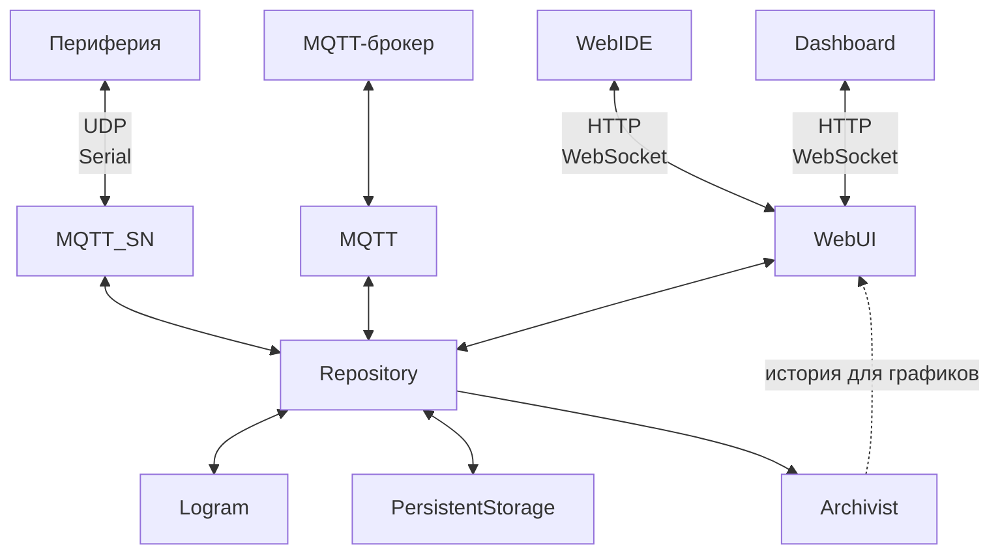

# Enviriot

**Low-code платформа для управления устройствами и автоматизации процессов.**

С её помощью можно объединять устройства в единую систему, следить за состоянием и управлять в реальном времени, выстраивая собственную логику их совместной работы.

В основе Enviriot лежат три составляющие:

- **Топики** содержат состояние, конфигурацию и описание каждого элемента системы.  
  >_Устройство, его настройка, показание датчика или результат вычисления представлены одинаково: как топики в общем дереве. Благодаря этому состояние всей системы можно наблюдать и изменять в реальном времени._
- **Лограммы** задают логику управления в виде визуальных схем.  
  >_Лограммы связывают топики в работающие алгоритмы. Визуальные блоки получают данные, обрабатывают их и передают результат дальше. Среди готовых блоков есть блок для выполнения пользовательского JavaScript, а при желании можно создать собственный вычислительный блок._
- **Плагины** добавляют новые возможности.  
  >_Плагины подключают устройства и внешние системы, обеспечивают хранение данных и накопление истории для графиков, выполняют лограммы и обслуживают пользовательские интерфейсы. Новые возможности реализуются отдельными плагинами и не требуют изменения ядра платформы._

## Как это работает

Enviriot состоит из сервера и набора плагинов. Сервер загружает компоненты, управляет их жизненным циклом и предоставляет общую среду выполнения. Плагины подключают устройства и внешние системы, сохраняют и обрабатывают данные, выполняют логику автоматизации и предоставляют пользовательские интерфейсы.

- **Repository** хранит дерево топиков и последовательно обрабатывает изменения на каждом тике. Он загружается как плагин с приоритетом 1 и собран вместе с сервером.
- **PersistentStorage** сохраняет состояние и конфигурацию топиков, а при запуске восстанавливает дерево.
- **Archivist** накапливает историю значений и подготавливает данные для построения графиков.
- **Logram** выполняет лограммы, передаёт данные между вычислительными блоками и записывает результаты в топики.
- **MQTT_SN** подключает устройства по протоколу MQTT-SN, используя UART или Ethernet/UDP в качестве транспорта.
- **MQTT** обеспечивает двусторонний обмен данными между топиками и внешними MQTT-брокерами.
- **WebUI** предоставляет два браузерных интерфейса:
  - **WebIDE** предназначен для настройки системы, разработки лограмм и диагностики;
  - **Dashboard** предназначен для повседневного наблюдения и управления. Каждый дашборд создаётся как отдельная HTML-страница из готовых компонентов и показывает только нужные пользователю значения, графики и элементы управления.

Все плагины взаимодействуют через дерево топиков и не обращаются друг к другу напрямую. Они публикуют данные в топиках и подписываются на интересующие их изменения.

## Сервер

Сервер предоставляет общую среду выполнения платформы: загружает компоненты, управляет их жизненным циклом, поддерживает дерево топиков и последовательно проводит изменения через движковый тик.

### Границы ответственности

- **Серверный хост** отвечает за загрузку компонентов, порядок запуска, движковый поток и корректное завершение работы.
- **Repository** отвечает за дерево топиков, порядок применения изменений и доставку событий, но не интерпретирует назначение данных.
- **JsLib** задаёт единые правила работы с `JSValue`.
- **JsExtLib** предоставляет среду выполнения JavaScript, которую использует плагин Logram.
- **RPC** маршрутизирует именованные действия.
- **Журнал** принимает сообщения от всех компонентов и ограничивает поток повторяющихся ошибок.
- **Плагины** определяют прикладной смысл топиков и подключают к дереву отдельные подсистемы.

### Платформа и запуск

Сервер Enviriot разработан на .NET Framework 4.8. Он может работать как консольное приложение или как служба Windows.

При запуске сервер:

1. проверяет, что на компьютере не запущен другой экземпляр Enviriot;
2. загружает сервер и плагины через MEF;
3. вызывает `Init()` у всех включённых плагинов по возрастанию приоритета;
4. вторым проходом, в том же порядке, вызывает `Start()` — когда инициализированы уже все;
5. запускает периодический тик движка;
6. сообщает вызывающей стороне, завершился ли запуск успешно.

Если `Init()` или `Start()` одного из плагинов завершается ошибкой, сервер прекращает запуск и останавливает уже затронутые плагины в обратном порядке. `Stop()` может быть вызван для частично инициализированного плагина, поэтому его реализация не должна предполагать, что предыдущий этап завершился полностью.

В режиме службы Windows сервер запрашивает дополнительное время на запуск, поскольку восстановление и резервное копирование базы могут занимать больше стандартного интервала ожидания Service Control Manager. Для аварийного завершения службы настроены попытки автоматического перезапуска.

Подробнее: [Program](Server/Program.cs), [HAServer](Server/HAServer.cs), [IPlugModul](Server/IPlugModul.cs).

### Движковый поток и плагины

Основная работа сервера сводится к одному движковому потоку. На нём выполняются:

- инициализация и запуск плагинов;
- периодические вызовы `Tick()`;
- обработка очереди изменений Repository;
- применение результатов фоновых операций;
- выполнение JavaScript и его таймеров;
- остановка плагинов.

Такой порядок упрощает взаимодействие компонентов: внутри тика им не требуется синхронизировать доступ к общему состоянию. Длительная операция задерживает весь сервер, поэтому сетевые запросы, обращения к базе и другая потенциально долгая работа должны выполняться вне движкового потока, возвращая на него только готовый результат.

Плагин реализует интерфейс `IPlugModul`:

- `Init()` получает необходимые ресурсы;
- `Start()` начинает работу после запуска всех плагинов с меньшим приоритетом;
- `Tick()` выполняет один проход обработки;
- `Stop()` освобождает ресурсы;
- `Owner` указывает на конфигурационный топик плагина в `/$YS`;
- `enabled` определяет, должен ли плагин запускаться.

Плагины запускаются по возрастанию `priority`, а останавливаются в обратном порядке. При одинаковом приоритете порядок стабилизируется именем плагина.

| priority | Плагин | Причина порядка |
|---:|---|---|
| 1 | Repository | До него дерева не существует, а остальные плагины читают `enabled` из дерева. |
| 2 | PersistentStorage | Восстанавливает сохранённые данные до того, как дерево начинают использовать другие плагины. |
| 3 | Archivist | Подписывается после восстановления топиков. |
| 5 | Logram | На старте обходит уже наполненное дерево и создаёт исполняемые объекты схем. |
| 7 | MQTT_SN | Поднимает шлюзы и обнаруживает устройства. |
| 8 | MQTT | Подключается к внешним брокерам. |
| 10 | WebUI | Открывает порт после готовности остальных компонентов. |

Исключение из `Tick()` регистрируется в журнале, но не отключает плагин: следующий тик будет вызван как обычно. Фактическая длительность и период тика, пиковое время прохода и максимальная длительность JavaScript публикуются в `/$YS/Performance`, если этот конфигурационный топик включён; по умолчанию он выключен.

Метод `JsExtLib.EnsureCfg()` помогает плагину объявить принадлежащий ему конфигурационный топик, сразу применить текущее значение и затем поддерживать его в актуальном состоянии через подписку.

Подробнее: [Program](Server/Program.cs), [IPlugModul](Server/IPlugModul.cs), [JsExtLib](Server/JsExtLib.cs).

### Журналирование и диагностика

Журнал принимает сообщения из разных потоков через очередь и асинхронно отправляет их:

- в отладочный вывод;
- в консоль;
- в ежедневный файл;
- подписчикам, например WebUI и хранилищу истории.

Каждый подписчик вызывается отдельно. Ошибка одного обработчика не останавливает запись в файл и не мешает остальным подписчикам получить сообщение.

`FaultThrottle` ограничивает поток повторяющихся ошибок. Для каждой пары «место ошибки и тип исключения» регистрируется первое сообщение, подсчитываются подавленные повторы и формируется итоговая запись. Это защищает журнал от десятков одинаковых сообщений на каждом тике, не скрывая сам факт повторяющегося сбоя.

Подробнее: [Log](Server/Log.cs), [FaultThrottle](Server/FaultThrottle.cs).

## Документация плагинов

Подробное описание каждого плагина вынесено в отдельный файл:

- [Repository](Server/Repository/Repository.md)
- [PersistentStorage](plugins/PersistentStorage/PersistentStorage.md)
- [Archivist](plugins/Archivist/Archivist.md)
- [Logram](plugins/Logram/Logram.md)
- [MQTT_SN](plugins/MQTT_SN/MQTT_SN.md)
- [MQTT](plugins/MQTT/MQTT.md)
- [WebUI](plugins/WebUI/WebUI.md)
