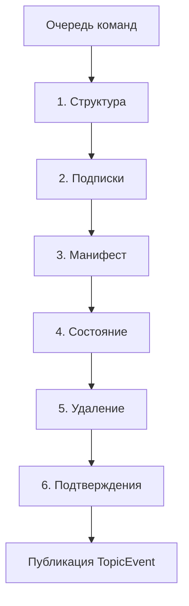

# Repository
Repository хранит общую модель системы в виде дерева топиков. Для остальных компонентов топик является одновременно адресуемым элементом дерева и единицей обмена данными.

У топика есть:

- путь, например `/A/B`;
- состояние в формате `JSValue`;
- манифест с конфигурацией и описанием;
- атрибуты, хранящиеся в поле `attr` манифеста;
- дочерние топики;
- подписки на состояние, поля манифеста и изменения структуры.

Состояние содержит текущее значение топика, а манифест описывает сам топик и правила работы с ним. Основные атрибуты:

- `Required` запрещает удаление топика через WebIDE;
- `Readonly` запрещает изменение состояния через WebIDE;
- `DB` указывает PersistentStorage сохранять состояние топика;
- `Config` включает состояние топика в файл конфигурации;
- `Internal` отмечает внутренний элемент системы (невидим для MQTT и MQTT-SN).

`DB` и `Config` являются взаимоисключающими способами сохранения состояния. Манифест сохраняется независимо от этих атрибутов, поэтому топик может существовать в дереве без сохранённого состояния.

Тип элемента также задаётся через топик: поле `type` манифеста ссылается на топик под `/$YS/TYPES`, а унаследованное описание хранится в состоянии этого топика. Наследование разрешает компонент, которому оно требуется, а не Repository.

Подробнее: [Topic](../../Server/Repository/Topic.cs).

## Очередь изменений и тик Repository

`SetState()` и `SetField()` не изменяют значение непосредственно в месте вызова. Они создают команды, которые Repository обрабатывает на следующем тике.

Сначала Repository разбирает всю очередь и применяет команды в порядке фаз. Только после этого события публикуются подписчикам. Поэтому обработчик события видит согласованное состояние дерева, а не промежуточный результат обработки пакета.

`Cmd` описывает запрошенное изменение и остаётся внутренней деталью Repository. `TopicEvent` сообщает о фактически произошедшем изменении и доступен подписчикам.

Изменения структуры имеют особую семантику:

- создание и перемещение топика меняют дерево сразу, на потоке вызывающего кода;
- `Remove()` сразу помечает топик удалённым;
- соответствующие события публикуются позднее, во время тика.

Несколько команд изменения состояния одного топика в пределах тика сворачиваются в одну, причём сохраняется последнее значение. Команды изменения разных полей манифеста объединяются в один новый манифест, но каждое изменённое поле получает собственное событие.

После публикации `TopicEvent` каждый подписчик самостоятельно решает, относится ли изменение к его предметной области.

Подробнее: [Repo](../../Server/Repository/Repo.cs), [Cmd](../../Server/Repository/Cmd.cs), [TopicEvent](../../Server/Repository/TopicEvent.cs).

## Подписки

Подписка хранится на том топике, где она создана, и не копируется во все элементы поддерева. При публикации события Repository поднимается от изменённого топика к его родителям и выбирает подходящие подписки по маске.

Маска определяет область и вид интересующих изменений:

- `Once` включает сам топик;
- `Children` включает непосредственных потомков;
- `All` включает всё поддерево;
- `Value` включает изменения состояния;
- `Field` включает изменения выбранной ветви манифеста.

Перемещение объявляется обоим родителям: и тому, под которым топик оказался, и тому, которого он покинул. Событие при этом одно и то же — `Source` указывает на новое место, `OldPath` на прежнее, — а подписка, накрывающая оба места сразу, получает его один раз. Без второго объявления следящий за составом своих детей остался бы с потомком, которого там больше нет, и узнать об уходе ему было бы неоткуда.

При создании подписки сначала формируется снимок уже существующих данных, затем публикуется событие `Ready`. После него подписчик получает только новые изменения. Возвращаемый объект `SubRec` принадлежит вызывающему коду и должен быть освобождён через `Dispose()`.

Такое устройство подписок сохраняет их при перемещении поддерева и не требует копирования регистраций по всем его узлам.

Подробнее: [SubRec](../../Server/Repository/SubRec.cs), [Topic](../../Server/Repository/Topic.cs).

## Конфигурация и формат XST

Формат `.xst` используется для импорта и экспорта поддеревьев Repository. В XML состояние и манифест хранятся как JSON, а атрибут `ver` позволяет пропускать элементы, версия которых не новее уже загруженной.

Импорт выполняется в два прохода. Сначала документ полностью читается и проверяется, затем подготовленный план применяется к дереву. Ошибка имени или пути не оставляет частично созданное поддерево.

Экспорт сначала записывает новый документ во временный файл, а затем атомарно заменяет целевой файл. Если замена не удалась, Repository не отбрасывает изменение, а повторяет сохранение позже. При неудачном импорте сервер не перезаписывает исходный файл конфигурации частично восстановленным деревом.

Подробнее: [Xst](../../Server/Repository/Xst.cs), [Repo](../../Server/Repository/Repo.cs).

## JSValue

Состояния и манифесты представлены значениями NiL.JS. Класс `JsLib` содержит единые правила безопасного чтения `JSValue`, обработки `null` и `undefined`, доступа к вложенным полям, клонирования и сравнения значений.

Особое внимание требуется объектным значениям: `JSValue.Null` имеет объектный тип, но не содержит индексируемого объекта. Для чтения внешних данных следует использовать функции `JsLib`, а не разрозненные проверки и неявные преобразования.

Подробнее: [JsLib](../../Server/JsLib.cs).

## RPC

RPC предоставляет единое пространство имён серверных действий. Обработчик регистрируется по имени и получает:

- топик, к которому относится действие;
- один аргумент в формате `JSValue`;
- функцию ответа, если результат может быть сформирован позднее.

Обработчик без результата автоматически отвечает `undefined`. Для асинхронного обработчика сервер пропускает только первый ответ. Если обработчик с указанным именем не зарегистрирован, `RPC.Call()` возвращает `false`.

Серверный RPC не определяет транспорт, права доступа или предельное время ожидания. Эти обязанности принадлежат вызывающему слою, например WebUI.

Подробнее: [RPC](../../Server/Rpc.cs).

---

[Вернуться к основному README](../../README.md)
