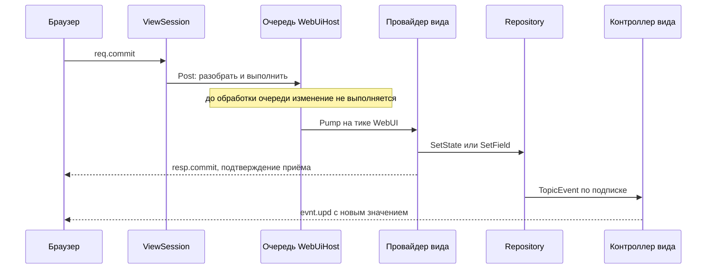
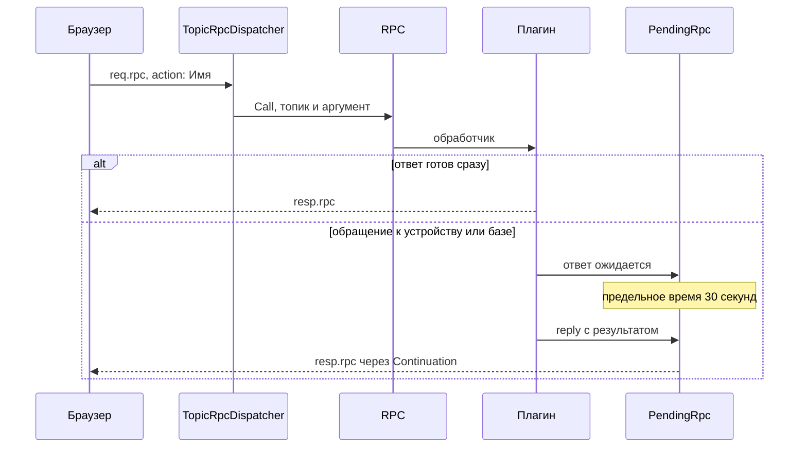

# WebUI
WebUI предоставляет браузерный доступ к системе двумя интерфейсами: WebIDE и Dashboard.

### Два интерфейса: IDE и дашборды

| | WebIDE | Dashboard |
|---|---|---|
| Что показывает | Дерево целиком, Inspector, лограммы, каталог и журнал | Заранее собранную страницу: графики, кнопки, регуляторы и другие компоненты |
| Протокол | `req.*`, `resp.*`, `evnt.*` с адресацией по `vid` | Табличные кадры `C`, `P`, `S`, `A` |
| Кто собирает страницу | Предустановлен | Пользователь, файлами в `Output/www` |
| Сетевой доступ | Закрыт целиком | Разрешения определяются топиками |
| Фронтенд | Lit, каталог `www/ide` | Symbiote, каталог `www/components` |

Разные модели доступа являются архитектурным решением. WebIDE изменяет структуру и конфигурацию всей установки, поэтому его сетевой доступ закрывается целиком. Dashboard предназначен для повседневного использования и показывает только данные, разрешённые манифестами топиков.

Общими остаются порт и модель выполнения: сокет принимает кадр и ставит задание в очередь, а серверная логика сессии выполняется на движковом потоке.

Подробнее: [WebUiHost](../../(plugins/WebUI/WebUiHost.cs)), [ViewSession](../../(plugins/WebUI/ViewSession.cs)), [DashboardSession](../../(plugins/WebUI/ApiDashboard.cs)).

### WebIDE

WebIDE предоставляет представления дерева, Inspector, Logram, каталога и журнала. Строка представления адресуется идентификатором `vid`: команды передаются сообщениями `req.*`, подтверждения — сообщениями `resp.*`, изменения данных — сообщениями `evnt.*`. Ответ на команду означает «принято», а не гарантирует, что новое состояние уже опубликовано.

Некоторые константы интерфейса, например размер клетки Logram и минимальный размер холста, дублируются на клиенте и сервере осознанно. Их согласованность проверяет [ClientContractTests](../../(Tests/ClientContractTests.cs)).

#### Путь правки из IDE



Новое значение приходит отдельным сообщением `evnt.*` — тем же путём, каким пришло бы изменение от устройства или другого плагина.

Подробнее: [ViewSession](../../(plugins/WebUI/ViewSession.cs)), [WebUiHost](../../(plugins/WebUI/WebUiHost.cs)).

#### Контекстное меню: Add и Action

Контекстное меню строится на сервере: на каждый запрос `req.menu` сервер собирает список пунктов для той строки, на которой его вызвали, а браузер только рисует полученное. Меню дерева собирает `MenuBuilder`; у панелей Inspector сборка своя, о ней ниже. Постоянная часть меню дерева — открыть, переименовать, вырезать, удалить, экспортировать — одинакова для всех топиков, а два раздела объявляют сами топики полями манифеста: `Children` даёт пункты **Add**, создающие дочерний топик, а `Action` — пункты **Action**, просящие плагин выполнить операцию.

Пункты Add ищутся по цепочке взаимоисключающих случаев, до первого сработавшего:

1. собственное поле `Children` — объект: пункты берутся из него, после чего к ним добавляются недостающие из `Children` типового топика;
2. собственное `Children` — строка: она читается как путь к топику, и пунктами становятся дети этого топика, а тип уже не участвует;
3. собственного поля нет: работает `Children` типа — объектом или строкой-путём, по тем же правилам;
4. ничего не нашлось: подставляются дети `/$YS/TYPES/Core` — Boolean, Double, Folder, Integer, Logram, Object и String.

Ключ объекта становится именем пункта, а сам объект считается пунктом Add, если у него есть `default` или `manifest`.

Пункты Action собираются из поля `Action` манифеста топика и из `Action` в состоянии типового топика; совпавшие имена берутся один раз, пункты сортируются по подписи. Имя пункта — это имя обработчика в RPC, и связь держится только на совпадении строки: объявленному действию `MQTT_SN.PLC.Build` отвечает `RPC.Register("MQTT_SN.PLC.Build", …)` в плагине MQTT_SN. Поэтому новая операция добавляется двумя независимыми шагами: плагин регистрирует обработчик, а топик или его тип объявляет действие с этим именем. Обычно `Action` — массив объектов, но подойдёт и объект, ключи которого станут именами.

Поля дескриптора:

| Поле | Где | Что задаёт |
|---|---|---|
| `default` | Add | начальное состояние создаваемого топика |
| `manifest` | Add | начальный манифест создаваемого топика |
| `willful` | Add | имя ребёнка спрашивается у пользователя; без этого поля именем становится ключ |
| `menu` | Add | путь подменю, части разделяются `/` |
| `rc` | Add | заявка на ресурс (`X1` — монопольно, `S40` — совместно); пункт, ресурс которого уже заняли соседние топики, в меню не попадает |
| `ddr` | Add | направление пина лограммы: меньше нуля — вход, больше нуля — выход |
| `path` | Add | поле, куда пишется запись, если это не её собственный ключ; только каталог `mi` |
| `name` | Action | имя обработчика RPC; при отсутствии берётся ключ |
| `text` | Action | подпись пункта; при отсутствии — имя |
| `icon` | оба | путь к файлу, семантическое имя или `data:image/…` |
| `hint` | оба | подсказка |

`ddr` выпадает из общего ряда: меню его не читает. Одна и та же запись `Children` описывает и пункт меню, и пин блока лограммы, поэтому у типов лограмм рядом с `default` и `rc` стоит направление пина, а дочерний топик без `ddr` пином не становится.

Так это выглядит в описаниях типов — `Core/Integer` и `Ext/DevicePLC` из [base.xst](../../(Server/Repository/base.xst)), `TWI/MAX44009` из опубликованного каталога:

```json
{"default":0,"editor":"Integer","icon":"Integer","manifest":{"attr":4,"editor":"Integer"},"willful":true}

{"Action":[{"name":"MQTT_SN.PLC.Build","text":"Build programm"},{"name":"MQTT_SN.PLC.Run","text":"Run"}](../../}

{"Children":"/$YS/TYPES/TWI"}
```

Выбранный пункт уходит на сервер как `req.rpc` с командой `add:<ключ>` или `action:<имя>`. В дереве её исполняет `TopicRpcDispatcher`: Add создаёт дочерний топик из `default` и `manifest`, Action сверяет имя с тем, что топик объявил, и передаёт вызов в RPC — что происходит дальше, описано в разделе «Действие и отложенный ответ».

Панели Inspector строят своё меню Add по тем же правилам, но по другой схеме и с другим результатом. Дерево создаёт дочерний **топик** и берёт пункты из `Children`; панель State добавляет поле в **состояние** топика и берёт пункты из `Fields`; панель Manifest добавляет поле в **манифест** и берёт их из `mi`. Источники схемы накладываются друг на друга: у State это каталог типового топика, поверх которого ложится собственный манифест, у Manifest перед ними стоит ещё и общая схема `/$YS/TYPES/Ext/Manifest`. Спускаясь в поле, наложение спускается сразу по всем источникам, у которых этот ключ есть, а запасной каталог у всех трёх меню один и тот же — `/$YS/TYPES/Core`.

Отличий от дерева два. Пункт не предлагается, если поле уже есть; в манифесте это проверяется по `path`, когда запись идёт не в собственный ключ дескриптора — так `DashboardRO` пишет `dashboard.netRO`. И пунктов Action у панелей нет вовсе, только Add и Delete: действия в Inspector вызывают кнопки редакторов, а не меню. Уходят они в тот же `TopicRpcDispatcher.ExecuteAction`, причём всегда против корневого топика документа, а не строки поля, — поэтому правило «вызвать можно только объявленное имя» одинаково в дереве, в обеих панелях и в кадре `A` дашборда.

Подробнее: [MenuBuilder](plugins/WebUI/Helpers/MenuBuilder.cs)), [TopicRpcDispatcher](../../(plugins/WebUI/Helpers/TopicRpcDispatcher.cs)), [SchemaOverlay](../../(plugins/WebUI/Trees/SchemaOverlay.cs)), [base.xst](../../(Server/Repository/base.xst)).

### Dashboard

Dashboard состоит из HTML-страниц и готовых компонентов в `Output/www`. Страница создаётся пользователем.

Право доступа объявляет сам топик полями `dashboard.netRW` и `dashboard.netRO` в манифесте. Разрешение выбирается по наиболее конкретному совпавшему пути. Если подходящего объявления нет, доступа нет.

Эта модель не открывает редактор дерева наружу: сетевой пользователь Dashboard работает только с явно разрешённой частью данных.

Подробнее: [DashboardSession](../../(plugins/WebUI/ApiDashboard.cs)), [NetworkAcl](../../(plugins/WebUI/Helpers/NetworkAcl.cs)), [DashboardAcl](../../(plugins/WebUI/Helpers/DashboardAcl.cs)).

### Действие и отложенный ответ

Действие позволяет попросить плагин выполнить операцию над топиком. Доступное действие объявляется в манифесте, поэтому вызвать имя, которого топик не объявил, нельзя.



Серверный `RPC.Call()` обеспечивает не более одного ответа от обработчика. WebUI добавляет ожидание отложенного результата и предельное время в 30 секунд. Без серверного срока забытый ответ оставил бы клиентский запрос незавершённым на всё время жизни страницы.

Этот путь используется контекстным меню дерева, действиями Inspector и кадром `A` Dashboard.

Подробнее: [RPC](../../(Server/Rpc.cs)), [TopicRpcDispatcher](../../(plugins/WebUI/Helpers/TopicRpcDispatcher.cs)), [PendingRpc](../../(plugins/WebUI/Helpers/PendingRpc.cs)).

---

[Вернуться к основному README](../../README.md)
